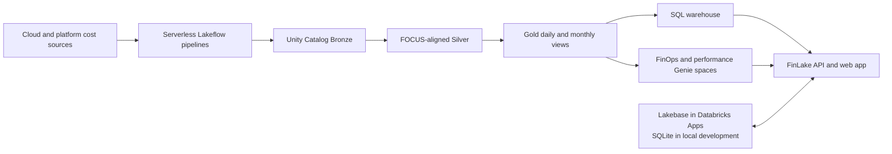

# Architecture and extension guide

FinLake separates governed cost facts from operational application state. Unity
Catalog is the source of truth for cost analytics; Lakebase or SQLite stores the
state needed to operate the app.

## End-to-end flow

Some connectors start from data already registered in Unity Catalog; others
land or reference raw exports before transformation. In both cases, the target
journey is a reproducible source-to-Gold pipeline, not disconnected demo tables.

## Components

| Component         | Responsibility                                                                                 |
| ----------------- | ---------------------------------------------------------------------------------------------- |
| `apps/web`        | React 19/Vite UI for setup, exploration, budgets, Genie, and recommendations                   |
| `apps/api`        | Express API, authentication, SQL statement execution, source setup, and pipeline orchestration |
| `packages/shared` | Zod contracts and shared SQL templates used by the API and UI                                  |
| `packages/db`     | Repository abstraction backed by Lakebase or SQLite                                            |
| Unity Catalog     | Governed cost tables, volumes, schemas, grants, and lineage                                    |
| Lakeflow          | Source normalization and Silver/Gold materialization                                           |
| SQL warehouse     | Runtime query execution for app analytics and setup checks                                     |
| Genie             | Natural-language analysis over governed Gold data                                              |

## Data model and metric semantics

FinLake uses FOCUS-aligned columns to compare providers without erasing the
original billing context. `EffectiveCost` is the primary cross-provider spend
measure. List, billed, and contracted cost remain distinct measures and should
not be substituted for one another.

The app does not perform currency conversion. A production implementation must
either constrain analysis to a common billing currency or add a governed FX
conversion process with an agreed rate source and period.

Gold daily data supports trends and forecasting. Gold monthly data supports
ownership, tags, showback, and unallocated-cost questions.

## Identity and access

- The Databricks App service principal uses M2M OAuth for shared system-table,
  setup, pipeline, and governed-data operations.
- User OBO tokens are reserved for user-scoped operations.
- SQL warehouses are discovered and selected at runtime. They are not fixed in
  the Asset Bundle.
- Query caches are scoped by the relevant user and warehouse context.
- Unity Catalog grants remain the enforcement point for governed cost data.

Grant only the scopes and catalog privileges required by the sources and
features you enable. Review generated remediation SQL, Terraform, and CLI
commands before applying them in a customer environment.

## Operational state

`LAKEBASE_ENDPOINT` controls the database backend:

- Present: use Lakebase and fail startup if it cannot be initialized or checked.
- Absent: use SQLite, including `:memory:` for tests.

The deployed app uses a dedicated Lakebase schema derived from the app identity.
Do not add a second backend-selection path elsewhere in the application.

## Blueprint extension points

For a customer implementation, prefer extending the existing seams:

1. **New data source:** add its catalog definition, shared setup step, API check,
   and drawer configurator.
2. **New cost dimension:** add it to the shared FOCUS contract and pipeline SQL,
   then propagate it to Gold and the relevant UI queries.
3. **Ownership policy:** map the customer's approved tag keys and organizational
   hierarchy into governed Gold tables.
4. **Allocation policy:** implement and test explicit shared-cost rules before
   exposing chargeback totals. The existing tag rules and monthly data are a
   foundation, not a complete allocation engine.
5. **Budget evaluation:** join each budget scope to its matching actual and
   forecast series before adding scope-level alerts or enforcement.

## Production readiness checklist

- Reconcile source totals against provider invoices for a closed billing period.
- Define currency, time-zone, credits, taxes, refunds, and amortization policy.
- Validate Unity Catalog grants and service-principal scopes with least privilege.
- Define pipeline freshness objectives, monitoring, retry, and incident ownership.
- Test Lakebase backup, retention, migration, and recovery procedures.
- Validate budget and savings calculations with Finance before operational use.
- Remove or sanitize all customer-identifying data from reusable artifacts.

FinLake supplies an integrated reference implementation. Organization-specific
controls determine whether that implementation is ready for production.
